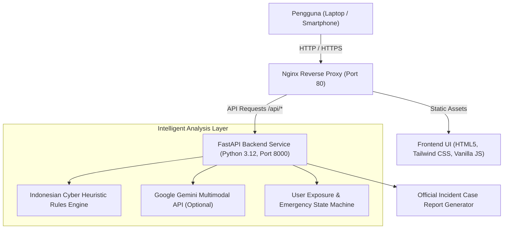

# ScamGuard AI
> **Sistem Intelijen Keamanan Siber, Penilaian Risiko Multidimensi, dan Mitigasi Insiden Penipuan Digital**  
> *Target: IDwebhost AI HackFest 2026 | Kategori: Cyber Security & Anti Scam*

---

## 1. Ringkasan Eksekutif

ScamGuard AI adalah platform perlindungan penipuan digital (*anti-scam intelligence*) berbasis kecerdasan buatan (AI) yang dirancang khusus untuk memverifikasi keaslian pesan, tautan (URL), dokumen APK, tangkapan layar, maupun panggilan suara yang mencurigakan. Platform ini dirancang dengan prinsip **Trustworthy Security Intelligence**, mengutamakan aksesibilitas bagi kelompok rentan—khususnya orang tua dan lansia yang kerap menjadi sasaran empuk rekayasa sosial (*social engineering*).

Sistem tidak memberikan vonis biner yang terburu-buru, melainkan menghitung **Penilaian Risiko Tiga Dimensi**:
1. **Content Risk (0–100%)**: Bobot bahaya teknis konten berdasarkan indikator heuristik dan analisis AI.
2. **Confidence Score (0–100%)**: Derajat keyakinan sistem berdasarkan kelengkapan dan validitas bukti.
3. **User Exposure (0–100%)**: Tingkat keparahan interaksi yang telah dialami pengguna (apakah sekadar menerima, membuka link, menyerahkan password, atau memberikan OTP).

Dokumentasi lengkap terkait spesifikasi produk dan sistem desain tersedia di:
- **Product Requirement Document**: [prd.md](file:///C:/ibra/project/web/lomba-idwebshost/prd.md)
- **Design System Specification (50 Bagian)**: [docs/DESIGN_SYSTEM.md](file:///C:/ibra/project/web/lomba-idwebshost/docs/DESIGN_SYSTEM.md)
- **Prototipe Statis Standalone**: [docs/prototype/index.html](file:///C:/ibra/project/web/lomba-idwebshost/docs/prototype/index.html)

---

## 2. Fitur Utama

- **Pola Progressive Disclosure**: Tampilan awal bersih dan minimalis; hanya menampilkan kartu *Pilih Cara Memasukkan Bukti*. Seluruh dashboard evaluasi, grafik risiko, indikator audit, wawancara, dan protokol kedaruratan baru muncul secara terstruktur setelah pengguna menekan tombol periksa.
- **Multimodal Evidence Intake**:
  - **Tautan / URL**: Analisis DNS, struktur subdomain, typosquatting, dan reputasi domain perbankan/institusi.
  - **Screenshot / Gambar**: Analisis visual dan ekstraksi teks via Optical Character Recognition (OCR).
  - **Pesan Teks**: Analisis rekayasa sosial, manipulasi urgensi, ancaman pemblokiran, dan peniruan identitas instansi.
  - **Transkrip Suara**: Dukungan Speech-to-Text browser untuk mempermudah lansia yang kesulitan mengetik.
- **Tipografi Risiko Dominan**: Angka skor risiko ditampilkan secara tegas dengan ukuran 64px (font-weight 700) menggunakan palet warna fungsional berbasis status (Hijau `#16A34A`, Kuning `#F59E0B`, Oranye `#B45309`, Merah `#DC2626`).
- **Wawancara Adaptif 3 Tahap**: Penilaian tingkat paparan (*User Exposure*) dinamis:
  - Tahap 1: Apakah tautan atau dokumen sempat dibuka?
  - Tahap 2: Apakah password, PIN, atau data kartu diserahkan?
  - Tahap 3: Apakah kode verifikasi SMS / OTP diserahkan ke pelaku?
- **Mode Kedaruratan & Protokol Pemulihan Akun**: Rekomendasi panduan mitigasi instan yang memprioritaskan tindakan penyelamatan dana nasabah beserta pintasan hotline bank resmi (HaloBCA 1500888, BRI 14017, Mandiri 14000).
- **Laporan Insiden Resmi**: Pembuatan resume dokumen audit insiden digital yang dapat langsung disalin ke papan klip (*clipboard*) atau diekspor ke format cetak PDF untuk pelaporan resmi ke bank atau kepolisian.
- **Zero Emojis & Precision UI**: Menghilangkan seluruh elemen dekoratif informal; menggunakan ikon garis Lucide (stroke 1.5–2px) dan border radius presisi (tombol 8px, kartu 12px, modal 16px, badge 999px).

---

## 3. Arsitektur & Tech Stack



- **Frontend**: Single Page Application bebas dependensi kompilasi kompleks (HTML5, Tailwind CSS via CDN, Lucide Icons, Web Speech API).
- **Backend API**: Python 3.12 + FastAPI + Pydantic v2 + Uvicorn.
- **AI & Heuristic Engine**:
  - *Primary*: Google Gemini 1.5 Flash multimodal vision & text API.
  - *Autonomous Fallback*: Built-in Indonesian Cybersecurity Heuristic Rules Engine yang tetap bekerja 100% offline tanpa ketergantungan API eksternal.
- **Web Server & Reverse Proxy**: Nginx Alpine dengan kompresi Gzip, CORS headers, dan isolasi jaringan.
- **Containerization**: Docker Compose untuk deployment satu perintah.
- **Target Infrastruktur**: IDwebhost Cloud VPS (Ubuntu 24.04 LTS, IP: `103.30.146.185`).

---

## 4. Panduan Deployment Cepat di VPS IDwebhost

### Langkah 1: Akses Server VPS via SSH
```bash
ssh -p 4422 root@103.30.146.185
```

### Langkah 2: Unduh Repositori
```bash
git clone https://github.com/aleakucing/scam-check.git ~/scamguard
cd ~/scamguard
```

### Langkah 3: Siapkan File Konfigurasi (Opsional)
```bash
cp .env.example .env
```
*Catatan: Jika `GEMINI_API_KEY` dikosongkan, ScamGuard AI otomatis beroperasi penuh menggunakan mesin analisis heuristik keamanan siber bawaan.*

### Langkah 4: Jalankan Service via Docker Compose
```bash
docker compose up -d --build
```

Setelah kontainer aktif, verifikasi status layanan:
```bash
docker compose ps
curl http://localhost/api/health
```

Aplikasi siap diakses publik melalui browser di:
- **Aplikasi Web**: `http://103.30.146.185`
- **Dokumentasi Interaktif API (Swagger UI)**: `http://103.30.146.185/docs`

---

## 5. Menjalankan di Lingkungan Pengembangan Lokal

### Menjalankan Backend:
```bash
cd backend
python -m venv venv

# Mengaktifkan virtual environment:
# Windows (PowerShell):
.\venv\Scripts\Activate.ps1
# Linux / macOS:
source venv/bin/activate

pip install -r requirements.txt
python -m uvicorn app.main:app --reload --port 8000
```

### Menjalankan Frontend:
Buka file `frontend/index.html` langsung di browser, atau sajikan melalui live server lokal:
```bash
cd frontend
python -m http.server 3000
```
Buka `http://localhost:3000` di peramban Anda.

---

## 6. Spesifikasi Endpoint API

| Method | Endpoint | Deskripsi |
|---|---|---|
| `GET` | `/api/health` | Pemeriksaan kesehatan sistem, status engine AI, dan versi aplikasi. |
| `POST` | `/api/analyze` | Melakukan analisis risiko bukti digital (URL, pesan teks, transkrip, screenshot). |
| `POST` | `/api/interview` | Mengevaluasi skor keterpaparan (*User Exposure*) dan tindakan kedaruratan. |
| `POST` | `/api/report` | Menghasilkan salinan laporan audit insiden digital resmi. |

---

## 7. Lisensi & Hak Cipta

Dikembangkan oleh Tim ScamGuard AI untuk **IDwebhost AI HackFest 2026**.  
Seluruh hak cipta dilindungi undang-undang.
